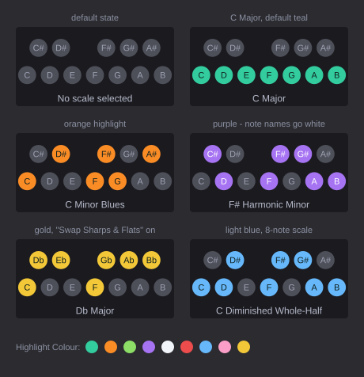
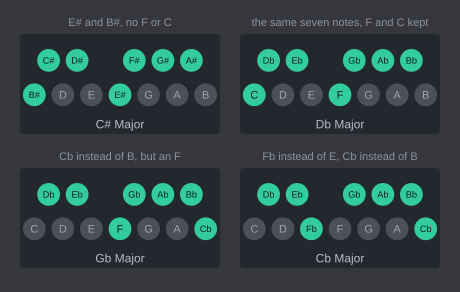

# ScaleView

A small ReaScript (Lua) icon for REAPER that shows the current key signature /
scale at a glance. Two scripts, both self-contained:

| Script | |
| --- | --- |
| `reascripts/ScaleView Pro.lua` | **The one to use.** Note names spelled for the key, an option to name them like piano keys instead, and the chord you play named underneath - see [below](#scaleview-pro) |
| `reascripts/ScaleView Simple.lua` | **The same thing without the chord detection.** It does not listen to what you play; everything else matches Pro |

Everything below describes both. The only difference is that Pro names the
chord you are playing and Simple does not listen at all; the section on chord
detection is the only one that does not apply to Simple.

> Also available as a **VST3 / AU / CLAP plugin** -
> [KallumS/ScaleView](https://github.com/KallumS/ScaleView) - which matches Pro
> and, unlike a ReaScript, can see MIDI items playing back rather than only
> live input.



The icon is 200 x 100 pixels and draws the twelve pitch classes as circles,
laid out like one octave of a keyboard without the keyboard:

- **Top row** - 5 circles, the black keys (C#, D#, F#, G#, A#), positioned over
  the gaps between the white keys they sit between, including the missing black
  key between E and F.
- **Bottom row** - 7 circles, the white keys (C, D, E, F, G, A, B).

By default every circle is the same colour. Click a circle to pick a
scale; the notes belonging to that scale change colour. Picking a scale does
nothing else - it is purely a visual reference, it does not touch the project,
MIDI editor snap settings, or anything else.

## Installing with ReaPack

In REAPER: **Extensions > ReaPack > Import repositories**, and paste exactly
this:

```
https://raw.githubusercontent.com/KallumS/ScaleView-for-Reaper/master/index.xml
```

Then **Extensions > ReaPack > Browse packages**, find ScaleView Pro or
ScaleView Simple under *Scales*, and install.

> **It has to be that URL, ending in `index.xml`.** Pasting the repository page
> instead - `https://github.com/KallumS/ScaleView-for-Reaper` - gives
> *"The received file is invalid: Premature end of data in tag meta line 269"*.
> That is ReaPack being handed GitHub's web page and finding HTML where it
> wanted XML; the `meta` tag it names is part of the page, not of this project.

## Installing by hand


Copy whichever script you want (or both) anywhere, then in REAPER:

1. **Actions > Show action list... > New action > Load ReaScript...**
2. Select the file.
3. Run it from the action list (or bind it to a key / toolbar button).

## Using it

| Action | Result |
| --- | --- |
| Click a circle | Scale list - pick a root note under a scale type |
| Click anywhere else | Display options - see below |
| `D` | Dock / undock the window |
| `Esc` or the close box | Quit |

### Display options

Clicking the icon clear of the circles opens:

| Option | Effect |
| --- | --- |
| Random Scale | Picks a scale at random, for when you can't decide - never the one already showing |
| Show Note Names | Draws the note name inside each circle |
| Simplify Note Names | Turns off key-aware spelling and names every note like a piano key |
| Highlight Colour | Teal (default), Orange, Light Green, Light Blue, Light Pink or Gold. Neither script offers White, because the ring around a note being played is white and a white highlight would swallow it |
| Dock Window | Dock or undock the icon |
| Close | Quit |

**Simplify Note Names** is purely cosmetic - it renames notes, it does not
change which notes are lit, and the label still names the key you picked, so
Gb Major still reads Gb Major while its circles read F#. The scale list carries
both spellings as separate entries - "C# Major" and "Db Major" are two rows of
the same submenu - so you pick the one the music is written in.

Which menu opens depends on where the click started, not which button was used:
a circle opens the scale list, empty space opens the options, and either mouse
button does the same thing. A click belongs where it began, so pressing on a
circle and drifting off still opens the scale list.

To keep it in the REAPER UI rather than floating, dock it (click clear of the
circles > **Dock Window**, or press `D`). The window position, dock state, size and the
selected scale are all remembered between sessions.

The drawing scales with the window, and keeps its 2:1 proportions centred in
whatever space it is given - so a dock that is much wider than it is tall shows
the icon at its natural shape in the middle rather than stretching the circles
across the full width.

## Scales included

Every one of these is available from all 18 spelled roots:

| Scale | Semitones from the root |
| --- | --- |
| Major | 0 2 4 5 7 9 11 |
| Minor (Natural) | 0 2 3 5 7 8 10 |
| Harmonic Minor | 0 2 3 5 7 8 11 |
| Ionian | 0 2 4 5 7 9 11 |
| Dorian | 0 2 3 5 7 9 10 |
| Phrygian | 0 1 3 5 7 8 10 |
| Lydian | 0 2 4 6 7 9 11 |
| Mixolydian | 0 2 4 5 7 9 10 |
| Aeolian | 0 2 3 5 7 8 10 |
| Major Pentatonic | 0 2 4 7 9 |
| Minor Pentatonic | 0 3 5 7 10 |
| Major Blues | 0 2 3 4 7 9 |
| Minor Blues | 0 3 5 6 7 10 |
| Whole Tone | 0 2 4 6 8 10 |
| Diminished Whole-Half | 0 2 3 5 6 8 9 11 |
| Diminished Half-Whole | 0 1 3 4 6 7 9 10 |

Ionian is the same set of notes as Major and Aeolian the same as Natural Minor;
both spellings are listed because both names are in common use. The two diminished scales are the eight-note octatonics: whole-half is
W H W H W H W H from the root, half-whole is the same pattern starting with the
semitone. With both spellings of every root plus Cb - 18 roots against 16
scale types - that is 288 selectable keys in total, plus **Clear Scale** to go
back to all circles the same colour.

## Customising

The colours are 0..1 RGB triplets near the top of the script:

```lua
local COLOR_BG       = {0.10, 0.10, 0.12}  -- icon background
local COLOR_OFF      = {0.30, 0.31, 0.35}  -- note not in the selected scale
```

The highlight colours are the `HIGHLIGHTS` table just below them. Add, remove
or retune entries freely - the menu is built from the table, and the chosen
colour is stored by name, so reordering the list cannot repoint an existing
choice. Keep new entries pale: the note names drawn on top of them are dark,
and the tests check every colour in the table is light enough to read them
against.

`DEFAULT_W` / `DEFAULT_H` set the icon size for a first run (200 x 100), and
the proportions it keeps when docked.

## ScaleView Pro

Pro does everything above, and adds the three things below: it names the
chord you play, it spells note names for the key you are in, and it keeps a
scale per project.

### How the chord is worked out

The other scripts match the notes you play against a table of chord shapes.
That works until you play something the table does not contain, and then there
is nothing to fall back on, so the label reads out the notes instead. The table
can always be made longer, but it cannot be made complete: a chord is a quality
with any number of tones stacked on top, and those combinations do not run out.

Pro reads the chord instead of looking it up. It splits the symbol in two:

- **The bottom half** - the third, the fifth and the seventh - is a closed
  vocabulary. Those three can only combine in about thirty ways and each
  combination has a name musicians agree on, so that half is still a table,
  ordered by how common each quality is.
- **The top half** - sixths, ninths, elevenths, thirteenths and their
  alterations - is not closed, so it is described rather than matched.
  Whatever the bottom half did not account for is read off as an extension.

Every note being held is tried as the root and the cheapest reading wins, where
the cost covers how unusual the quality is, what its extensions cost, and
whether the root had to be named after a slash. That last part is what keeps a
complete triad in an inversion ahead of a rooted chord with a hole in it: C E A
stays `Amin/C` rather than becoming a C6 with no fifth.

The practical difference, measured over every three-, four- and five-note
voicing in every bass position - 6,600 in all:

| | A chord table | Pro |
| --- | --- | --- |
| Named as a chord | 28% | **100%** |
| Read out as a list of notes | 72% | none |

Chords a table cannot name and Pro can include `C7b13`, `Cmaj7#11`,
`Cmaj9#11`, `C13b9`, `C13#11`, `C7#9#11`, `Cadd9Add11` and `Cmin11b5`, along
with extended chords voiced without the tones underneath them, which are
named for what is actually there: `C7(13)` rather than `C13` when the ninth is
missing.

Three rules do most of the work, and all of them come from the way musicians
read:

- **The root to the third decides most.** A quality the table does not name is
  ranked by whether it has a third at all: a real one, major or minor, keeps a
  chord readable however odd the rest of it is, a suspension is a stand-in for
  one, and a shape with neither is the last thing to reach for. That is what
  makes F A B read `F(b5)` rather than `B7b5(no3)/A`, which has no third in it.

- **The highest natural extension names the chord, if it is really there.** A
  stacked number claims every degree beneath it, so `C13` is only used when the
  ninth is played; otherwise the extension is bracketed after the seventh, as
  `C7(13)`. An altered ninth still counts, which is why `C13b9` keeps its
  number. A natural eleventh over a major third clashes, so it is bracketed
  whatever else is present.
- **An alteration has to belong to the chord it sits on.** A b9, a #9 and a b13
  are the dominant's alterations; over a minor seventh or a plain triad they
  are not colours a musician hears, they are a sign the root has been guessed
  wrong and the notes belong to some plainer chord standing on one of the
  others.

### The complete triad wins

Where two readings both fit, Pro favours the one with a **complete triad** in
it - root, third and fifth - and hangs the odd notes off that, even when the
thinner reading would need fewer of them. That is how Scaler 3 reads a chord.
Play C D Eb Gb Cb in Gb major and a reading that needs only one alteration
would give `D13b9/C`, a third and a seventh with no fifth; Pro and Scaler 3
both say `Cbaddb9#9/C`, a whole Cb triad with two.

Tested against real music, it names very nearly everything. Across the whole of
music21's core corpus - 3,194 scores from Palestrina to Schoenberg - plus 382
Bach chorales, 49 Chopin mazurkas and the standards repertoire's chord
vocabulary in all twelve keys, **99.999%** of the sonorities with three or more
different notes in them come back as a chord symbol that describes exactly what
is being played, with the right bass. The exceptions are four eight-note
clusters, which it reads out as notes on purpose.

Everything else above - the scales, the spelling, the clicking, the highlight
colours, the per-project key, the toolbar toggle - is the same in Simple. The
chord reader is the one thing it does not have: it never reads MIDI at all, so
the label always shows the scale name. Both can be installed at once, and they
keep their settings separately.

### What the selected scale does

The scale you have chosen is used, but only to settle a draw. Where two
readings come out at exactly the same cost, a root that is a degree of the
scale wins, and then a reading whose notes sit in it.

It is deliberately no stronger than that. A chord from outside the key is
named for what it is rather than bent to fit - play F# A# C# with C major
selected and it is `F#`, not something contorted into the key. Measured across
every voicing in every key, the key decides the name for 1.6% of them: the
genuine draws, which are semitone clusters and symmetrical chords like
C D# F# A#, where two roots are equally good and something has to choose.

**With no scale selected, the naming assumes C major.** The script starts that
way, and rather than going quiet until you pick something it reads those draws
as if the key were C. The assumption is invisible: no circle lights up, nothing
names a key, and choosing C Major from the menu gives exactly the same chord
names - a property the tests check over every three- and four-note voicing. C
major is the right one to assume because the note names already fall back to
it: with no accidentals in the key, the twelve read C C# D D# E F F# G G# A A# B
either way.

### What it listens to

Notes come from REAPER's global MIDI input history
(`MIDI_GetRecentInputEvent`), polled in the script's own loop. That means:

- It shows what you play on a controller, anywhere in REAPER, with no track
  or FX setup - just run the script.
- It does **not** see MIDI items playing back, and it is not per-track. Making
  it follow playback would need a small JSFX on the track feeding the script,
  which is a change to where the notes come from and nothing else.

If REAPER's input history cannot be read at all, the label says `MIDI input
unavailable` rather than failing - the script will not throw inside its own
defer loop.


### Spelling that follows the key

The note names are spelled for the key you pick instead of always being sharps
or flats.



Each note of a seven-note scale takes the next letter of the alphabet and
whatever accidental that letter then needs, which is how written music works:

| Key | Spelling |
| --- | --- |
| C# Major | C# D# E# F# G# A# B# - an E# rather than F, a B# rather than C |
| Db Major | Db Eb F Gb Ab Bb C - the same seven notes, but F and C stay as they are |
| F# Major | F# G# A# B C# D# E# - a B, but an E# rather than F |
| Gb Major | Gb Ab Bb Cb Db Eb F - a Cb rather than B, but an F |
| Cb Major | Cb Db Eb Fb Gb Ab Bb - an Fb rather than E, a Cb rather than B |

Because the spelling follows how the key is written rather than which notes
sound, C# major and Db major are different keys here even though they light the
same seven circles. **Random Scale** picks from those spellings too, so it can
land on Gb Major or F# Major. The scale list offers **both spellings of every
root** - C# and Db, F# and Gb, and so on - plus Cb, 18 roots in all. There is no
"Swap Sharps & Flats" option: the key decides. The five notes outside the
selected scale have no spelling of their own, so they are named in whichever
direction the key leans - flats in F major, sharps in G major.

Theoretical keys are spelled honestly rather than being tidied up, so D# major
comes out as D# E# Fx G# A# B# Cx (`x` is a double sharp, `bb` a double flat).
The fifteen real major keys never need one.

The shorter and longer scales follow their conventional spellings rather than
the one-letter-per-degree rule, which cannot apply to them: major blues repeats
a letter for its b3 and 3 (C D Eb E G A), and the eight-note diminished scales
repeat one letter (C D Eb F Gb Ab A B).

Simple and Pro are independent - separate files, separate saved settings -
so you can run either, or both at the same time.

### Clicking

It has no left-click and right-click menus. **Where** you click decides, and
either button does the same thing:

| Click | Opens |
| --- | --- |
| On a circle | The scale list |
| On empty space | Random Scale, note names, Simplify Note Names, highlight colour, dock, close |

A click belongs where it began, so pressing on a circle and drifting off still
opens the scale list. This replaced an earlier two-button arrangement, where a
menu's own click could be mistaken for a fresh one and open the wrong menu.
Both scripts work this way.

| | Gb Major | Cb Major | A# Harmonic Minor |
| --- | --- | --- | --- |
| Default (spelled for the key) | Gb Ab Bb Cb Db Eb F | Cb Db Eb Fb Gb Ab Bb | A# B# C# D# E# F# Gx |
| Simplify Note Names | F# G# A# B C# D# F | B C# D# E F# G# A# | A# C C# D# F F# A |

Simplified, every note is named the way its piano key is: sharps for the black
keys, and never a double accidental, so Cb reads B, Fb reads E and Gx reads A.

**Chord detection is unchanged** - it finds the same chords either way, and
only the names it reports follow the scheme. Gb Bb Db F reads `Gbmaj7` by
default and `F#maj7` simplified.

The **scale name underneath stays as you picked it** from the list: choose Gb
Major and it says Gb Major, even simplified, because that is the key you chose
and the name it has in the menu. Only the note names change.

ScaleView has been renamed a few times and has absorbed several earlier
scripts. The settings keys were left alone through all of that so nobody's
install would reset, and were tidied to match the filenames before the first
release - `ScaleViewPro` and `ScaleViewSimple`. Each script still reads the one
key it used immediately before that, so a pre-release install carries over.

### Each project remembers its own key

The scale is saved **into the project**, so reopening a project puts its key
back, and switching between open projects follows them. A project that has
never had a scale set is left showing whatever is already up rather than
blanking.

Everything else - highlight colour, note names, Simplify Note Names, window
position and dock state - stays global, because those are preferences rather
than anything about the music.

One consequence worth knowing: choosing a scale marks the project as edited,
since it is now part of the project. That is the cost of the project
remembering it.

### On a toolbar

The script reports its on/off state to REAPER, so a toolbar button bound to it
lights up while it is running, and clicking that button again closes it rather
than opening a second copy.

REAPER does not reopen scripts by itself when you restart it or reload a
project - a script runs until you stop it, and nothing records that it was
running. To have it start automatically, use a startup action: the SWS
extension offers both a global and a per-project one.

## Tests

`tests/` runs the scripts headlessly against a mock of REAPER's `gfx` and
`reaper` APIs, clicking menu entries by label and reading back which circles
were drawn lit. Neither needs REAPER, and both finish in under a second:

```
lua5.4 tests/test_scaleview_pro.lua
lua5.4 tests/test_scaleview_simple.lua
```

Both suites cover what the two scripts share: that a click on a circle opens
the scale list and a click on empty space opens the options **whichever button
is used**, that a click belongs where it began, the docked layout and the dock
bitfield, every highlight colour and its legibility, Simplify Note Names in
both directions, the scale saved into the project and followed across a project
switch, the toolbar toggle, and that settings saved under the key each script
used before the settings keys were renamed still load. They also replay the stray click a
modal menu reports after it closes - fired 0, 1 and 3 frames late - and check
that it opens nothing while clicks still work once the settle window passes.

**The Simple suite** is the one that sweeps the scales: all 288 root and scale
combinations against the interval formulas. It also proves the absence of chord
detection rather than assuming it, by counting every call into
`MIDI_GetRecentInputEvent` and failing if the script makes one - four notes are
left waiting in the mocked history, and it never asks.

**The Pro suite** adds everything about the chord reader: the examples above,
triads and sevenths, inversions and slash chords, the C6/Amin7 ambiguity in all
three bass positions, the chords a table could not name, note-offs and
all-notes-off, that re-polling never applies an event twice, and that a missing
or misbehaving input API degrades to `MIDI input unavailable` instead of
throwing. It covers the key-aware spellings and the chord-symbol fallback for
double accidentals, and that simplifying renames notes without changing which
chords are found.

Two property tests stand behind the whole approach. Every three- and four-note
voicing - 715 of them - must come back as a chord rather than a list of notes;
and all 715 must name identically with no scale selected as with C Major, which
is what makes the assumed key invisible.

Each regression test here was run against the engine before the fix and watched
to fail, because a test that passes against the bug is worthless.

The mock reproduces REAPER's real `gfx.showmenu` contract: the returned index
counts **only selectable items**, so separators and submenu headers must not be
counted when mapping the result back to an action.
